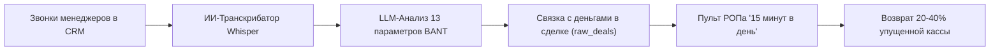

# 💼 БИЗНЕС-ПЛАН: «ИИ-Речевая Аналитика + RevOps Платформа»
## Продажа оптимизации отделов продаж B2B через технологический хук «Троянский конь»

---

## 🎯 1. Исполнительное резюме (Executive Summary)

* **Суть бизнеса:** Сервис аудита и регулярной оптимизации отделов продаж (RevOps-as-a-Service), выявляющий утечки выручки на всех этапах воронки CRM.
* **Главный рыночный хук («Троянский конь»):** Вход к клиенту не через абстрактный консалтинг («давайте настроим регламенты»), а через осязаемый технологичный продукт — **ИИ-транскрибатор и речевой аналитик звонков** по 13 критериям (Whisper + LLM).
* **Монетизация:** Двухуровневая модель:
  1. *Setup Fee (Внедрение и оцифровка утечек):* **150 000 – 450 000 ₽** (разово).
  2. *MRR Retainer (Ежемесячная подписка и ведение RevOps):* **45 000 – 120 000 ₽ / мес** с компании.
* **Маржинальность:** **85–92%** (себестоимость ИИ-распознавания и LLM составляет всего ~0.8–1.5 ₽ за минуту разговора).
* **Цель на 12 месяцев:** 35 активных клиентов на ретейнере, **MRR 2 800 000 ₽**, годовая выручка с учетом внедрений — **38 000 000 ₽**.

---

## 💡 2. Почему рынок готов покупать: Проблема и Решение

### Проблема B2B-рынка (Боль 99% РОПов и Собственников):
1. **РОП слушает меньше 2% звонков** — у него физически нет времени слушать часы аудиозаписей. Контроль выборочный и субъективный.
2. **Менеджеры сливают лиды на первых секундах** — не фиксируют дату следующего шага (Next Step), не квалифицируют бюджет, боятся называть цену, хамят или мямлят.
3. **Сделки зависают в CRM годами** («кладбище зомби») — в пайплайне нарисовано 10 млн ₽, а в кассу падает 1.5 млн ₽.
4. **Консалтингу не верят** — классические тренеры по продажам стоят дорого, дают теорию в отрыве от CRM и не дают прозрачной оцифровки возврата денег.

### Наше решение:
Мы приходим и говорим:  
> *«Вам не нужны лекции и тренинги. Мы подключаем ИИ, который слушает **100% звонков** за 2 минуты, связывает каждый звонок с деньгами в вашей CRM, а наш дашборд каждое утро дает РОПу **список из 5 действий на 15 минут**, чтобы спасти горящие сделки».*



---

## 📦 3. Продуктовая линейка (Value Ladder)

| Уровень | Продукт | Формат и наполнение | Стоимость для клиента | Себестоимость (COGS) | Конверсия в след. шаг |
|---|---|---|---|---|---|
| **L0: Лид-магнит** | **«ИИ-Тест-драйв 3 звонков»** | Разбор 3 реальных звонков менеджеров по 13 критериям + отчет в PDF/Telegram | **0 ₽** (Бесплатно) | ~15 ₽ (API Whisper+LLM) | **40–50%** во встречу |
| **L1: Трипваер** | **«Экспресс-аудит утечек ОП»** | Расчет потерь на салфетке (`⚡ Экспресс-калькулятор 3 цифры`) + карта 7 грехов ОП | **15 000 ₽** (или 0 ₽ при оплате внедрения) | 2 часа работы эксперта | **60%** во внедрение |
| **L2: Core Offer** | **«Внедрение RevOps + Речевой ИИ»** | Подключение CRM, телефонии, развертывание Google Sheets V12.0, настройка Пульта РОПа | **150 000 – 450 000 ₽** | ~15 000 ₽ (n8n/сервер/скрипты) | **80%** в ретейнер |
| **L3: Recurring** | **«RevOps Подписка (MRR)»** | Регулярный ИИ-контроль 100% базы звонков, еженедельный спринт с РОПом, мониторинг алертов | **45 000 – 120 000 ₽ / мес** | ~3 000 – 8 000 ₽ / мес | Retention: 8+ месяцев |

---

## 👥 4. Идеальный портрет клиента (ICP)

### Основной сегмент (Sweet Spot):
* **Отрасли:** B2B-услуги, оптовая торговля, стройматериалы, сложная техника/производство, IT/SaaS, онлайн-образование (высокий чек), недвижимость, логистика.
* **Размер отдела продаж:** от 3 до 15 менеджеров + выделенный РОП (или собственник в роли РОПа).
* **Средний чек сделки:** от **100 000 ₽** до **5 000 000 ₽**.
* **Инфраструктура:** Используют amoCRM или Bitrix24 + облачную телефонию (Mango, UIS, Sipuni, Zadarma, Мегафон/МТС).
* **Главный триггер для покупки:** *«Трафик льем, лиды идут, а конверсия в оплату падает, РОП завален текучкой и не понимает, почему менеджеры сливают»*.

---

## 📣 5. Стратегия маркетинга и привлечения (Go-To-Market)

### Канал 1: Холодный аутрич в Telegram / WhatsApp (Быстрый старт за 0 ₽)
* **Целевые базы:** Каналы РОПов, чаты предпринимателей, базы выгрузок из HeadHunter (компании, которые ищут менеджеров по продажам или РОПа прямо сейчас — у них точно горит проблема!).
* **Скрипт первого касания (Оффер):**
  > *«Здравствуйте, [Имя]! Вижу, вы развиваете продажи в [Компания].  
  > Мы разработали речевого ИИ-агента, который за 2 минуты слушает звонки менеджеров и сразу подсвечивает: кто из них забыл назначить дату следующего шага, а кто сорвал диалог с VIP-клиентом.  
  > Хотим бесплатно разобрать **3 любых звонка ваших сотрудников** и прислать вам аудит: где менеджеры сливают ваши деньги.  
  > Скинуть 30-секундное видео, как выглядит отчет?»*

### Канал 2: Партнерская сеть интеграторов CRM
* Интеграторы amoCRM и Bitrix24 зарабатывают на настройке CRM, но клиенты часто недовольны, потому что «CRM настроили, а продаж больше не стало».
* **Оффер интегратору:** 20% пожизненный RevShare от нашего чека за передачу клиента на RevOps-аудит и ИИ-аналитику.

### Канал 3: Контент-маркетинг «Кладбище звонков»
* Публикация реальных анонимизированных скринов и аудио-кейсов:  
  * *«Как менеджер за 3 минуты разговора похоронил сделку на 1.8 млн ₽, сказав фразу "Ну вы подумайте, если что — наберите"»*.
  * Призыв в конце: *«Проверьте своих бойцов — протестируйте 3 звонка за 0 ₽»*.

---

## 💰 6. Юнит-экономика и себестоимость (COGS)

### Расчет себестоимости ИИ-аналитики на 1 компанию в месяц:
* **Исходные данные среднего клиента:**
  * 5 менеджеров по продажам.
  * Каждый совершает ~25 результативных звонков в день длительностью по 3 минуты.
  * В месяц (22 рабочих дня): $5 \times 25 \times 22 = 2 750$ звонков = **8 250 минут аудио**.
* **Расходы на инфраструктуру:**
  * Распознавание Whisper API (или Groq / Deepgram): ~0.003–0.006 \$ / мин $\approx$ **0.40 ₽ / мин**.
    $8 250 \text{ мин} \times 0.40 \text{ ₽} \approx 3 300 \text{ ₽}$.
  * LLM-анализ по 13 критериям (GPT-4o-mini / Claude 3.5 Haiku / DeepSeek V3): ~$0.001 за оценку диалога.
    $2 750 \text{ оценок} \times 0.10 \text{ ₽} \approx 275 \text{ ₽}$.
  * Сервер n8n / VPS: **1 200 ₽ / мес** (делится на 10 клиентов $\approx$ 120 ₽).
* **ИТОГО себестоимость ИИ на клиента:** **~3 700 ₽ / месяц**.
* **Цена подписки для клиента:** **65 000 ₽ / месяц**.
* **Валовая прибыль с 1 клиента в месяц:** **61 300 ₽ (Маржинальность 94.3%)!**

---

## 📈 7. Финансовая модель на 12 месяцев

| Месяц | Новых внедрений (Setup) | Активных на подписке (MRR) | Выручка Setup, ₽ | Выручка MRR, ₽ | Валовая выручка, ₽ | Расходы (COGS + Маркетинг), ₽ | **Чистая прибыль, ₽** |
|---|---|---|---|---|---|---|---|
| **М1** | 2 | 2 | 400 000 | 110 000 | 510 000 | 80 000 | **430 000** |
| **М2** | 3 | 5 | 600 000 | 275 000 | 875 000 | 140 000 | **735 000** |
| **М3** | 4 | 8 | 800 000 | 440 000 | 1 240 000 | 210 000 | **1 030 000** |
| **М4** | 4 | 11 | 800 000 | 605 000 | 1 405 000 | 260 000 | **1 145 000** |
| **М5** | 5 | 15 | 1 000 000 | 825 000 | 1 825 000 | 330 000 | **1 495 000** |
| **М6** | 5 | 19 | 1 000 000 | 1 045 000 | 2 045 000 | 380 000 | **1 665 000** |
| **М7** | 6 | 23 | 1 200 000 | 1 265 000 | 2 465 000 | 450 000 | **2 015 000** |
| **М8** | 6 | 27 | 1 200 000 | 1 485 000 | 2 685 000 | 500 000 | **2 185 000** |
| **М9** | 6 | 30 | 1 200 000 | 1 650 000 | 2 850 000 | 550 000 | **2 300 000** |
| **М10**| 7 | 34 | 1 400 000 | 1 870 000 | 3 270 000 | 620 000 | **2 650 000** |
| **М11**| 7 | 37 | 1 400 000 | 2 035 000 | 3 435 000 | 670 000 | **2 765 000** |
| **М12**| 8 | 41 | 1 600 000 | 2 255 000 | 3 855 000 | 750 000 | **3 105 000** |
| **ИТОГО**| **63** | **41** | **12 600 000** | **13 860 000** | **26 460 000** | **4 940 000** | **21 520 000 ₽** |

---

## 🧭 8. Пошаговый сценарий демонстрации и продажи (Sales Playbook)

```
Этап 1: Разбор 3 звонков (0 ₽) 
   └── Показать лист «🎙️ ИИ_Аудит»: 
       «Вот звонок вашего менеджера C-505. Балл 2/13. Ошибка: срыв контакта.
        Связанная с ним сделка D-109 на 600 000 ₽ зависла. Прямо сейчас эти деньги горят».

Этап 2: Расчет потерь на салфетке (30 секунд)
   └── Открыть лист «⚡ Экспресс_Калькулятор_3_Цифры»:
       Ввести 3 цифры клиента (Лиды: 120, Чек: 250 000 ₽, Менеджеров: 4).
       «Смотрите: ваши скрытые потери — 1 650 000 ₽ каждый месяц.
        За год это почти 20 млн ₽. В первый же месяц мы вернем от 500 000 ₽».

Этап 3: Демонстрация экрана спокойствия собственника
   └── Открыть лист «📋 Пульт_РОПа_15_Минут»:
       «Вашему РОПу больше не нужно тратить 4 часа на копание в CRM.
        Он открывает этот экран утром, видит ровно 5 горящих сделок, 
        делает 5 точечных регламентных действий за 15 минут — и касса защищена».

Этап 4: Выбор тарифа и оффер
   └── Открыть лист «⚙️ Настройки» (Конструктор тарифов):
       Включить нужные клиенту модули (Light / Pro / Enterprise) и выставить счет.
```

---

## 🚀 9. 14-дневный план быстрого старта (Roadmap)

### Дни 1–3: Упаковка инструментов
* [x] Боевая таблица настроена (`RevOps Platform V12.0` без ошибок формул, с графиками и разметкой).
* [ ] Подготовить Telegram-бота или форму приема 3 аудиофайлов от потенциальных клиентов.
* [ ] Оформить 1-страничный PDF-маркетинг-кит «Как ИИ находит слив 30% выручки в звонках».

### Дни 4–7: Первый тестовый трафик
* [ ] Собрать базу из 100 контактов коммерческих директоров и собственников (через HH.ru / чаты).
* [ ] Отправить 100 персонализированных сообщений с оффером «Бесплатный ИИ-аудит 3 звонков».
* [ ] Цель: получить 10–15 согласий на разбор звонков.

### Дни 8–11: Проведение тест-драйвов и демо
* [ ] Загрузить звонки в систему, прогнать через ИИ-аналитику.
* [ ] Назначить 7 Zoom-встреч по 20 минут.
* [ ] Провести презентацию по скрипту (ИИ_Аудит $\rightarrow$ Экспресс-калькулятор $\rightarrow$ Пульт РОПа).

### Дни 12–14: Закрытие первых 2 сделок
* [ ] Дожать клиентов оффером: *«Внедрение за 150 000 ₽ + первый месяц подписки в подарок при оплате на этой неделе»*.
* [ ] Зафиксировать первые **300 000 ₽ выручки** и запустить боевое внедрение.
